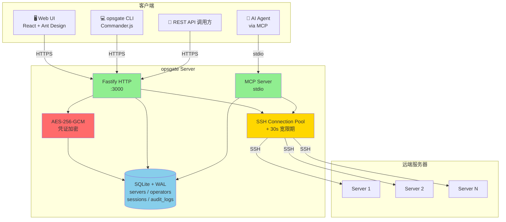

# 🛡️ opsgate

> **AI Agent 增强的 SSH DevOps 中台** — 让 AI Agent 和人类管理员都能在受控环境里安全操作成百上千台 Linux 服务器。

[](CHANGELOG.md)
[](LICENSE)
[](https://nodejs.org)
[](docs/DEPLOY.md)

[English](#) · [中文](README_CN.md) · [更新日志](CHANGELOG.md) · [架构](docs/ARCHITECTURE.md)

---

## 🎯 这是什么

**opsgate** 是给 DevOps 团队 + AI Agent 一起用的 **SSH 机器管理中台**。它解决了 3 个最常见的痛点:

1. **凭证散落** — SSH 用户名密码/私钥散落在各 AI Agent 的 prompt、IM 聊天记录、个人 wiki 里
2. **权限失控** — 谁能连哪台机器,执行什么命令,粒度太粗或没有
3. **审计缺失** — 谁在什么时间执行了什么命令,出问题追溯不到

opsgate 把这些全收敛到一个平台里,提供 4 种使用方式:

| 入口 | 适用场景 | 谁在用 |
|------|---------|--------|
| 🖥️ **Web UI** | 人在浏览器里操作、查审计、看 dashboard | DevOps 工程师、Team Lead |
| 💻 **CLI (`opsgate`)** | 终端里跑命令、CI/CD 集成、自动化脚本 | DevOps 工程师、CI 系统 |
| 🔌 **REST API** | 自己写代码集成、构建 dashboard | 平台开发 |
| 🤖 **MCP Server** | 让 AI Agent (Claude / Cursor / Cline) 直接调用 | AI Agent |

**4 种入口,共享同一个后端、一套凭证池、一份审计日志。**

---

## ✨ 核心特性

### 🔐 安全
- **凭证加密** — 所有 SSH 密码 / 私钥 / 私钥密码用 AES-256-GCM 加密落库,启动时强校验密钥
- **JWT + API Key 双鉴权** — 人用 JWT 登录,AI Agent 用 API Key(永久绑定到 operator)
- **RBAC** — 三级 scope(`admin` / `read` / `write`) × 服务器白名单
- **全量审计** — 8 个 MCP 工具 / 13 个 REST 端点 / Web 终端 / CLI 25 子命令,每次调用都落 `audit_logs`
- **输出脱敏** — 凭证 / 私钥自动 redact,输出 > 10KB 自动截断

### 🛠️ 能力
- **8 个 MCP 工具** — 4 个沿用 SSH + 4 个新增(状态 / 批量 / 搜索 / 审计查询)
- **13 个 REST 端点** — CRUD + 执行 + 上传下载 + 活跃会话 + 审计 + 健康检查
- **Web 终端** — 浏览器里 `xterm.js` 直接连 SSH shell,30s 复用宽限
- **批量操作** — 一条命令在 100 台机器上跑,并行数 / 失败快速终止 / dry-run 全支持
- **SFTP** — 上传下载带路径白名单,防 `~/.ssh/authorized_keys` 被恶意覆盖

### 🐳 工程化
- **Docker Compose 一键起** — 多阶段构建,最终镜像 ~200MB
- **健康检查** — 30s 一次,失败 3 次转 unhealthy
- **SQLite (WAL)** — 单文件,够撑上千台 server 元数据 + 几十万条审计
- **monorepo (npm workspaces)** — `@opsgate/server` + `@opsgate/cli` + `@opsgate/web` 三个子包,各自独立构建

---

## 🏗️ 架构



详细架构说明:[docs/ARCHITECTURE.md](docs/ARCHITECTURE.md)

---

## 🚀 快速开始(5 分钟)

### 方式 1:Docker(推荐)

```bash
# 1. 拉代码
git clone https://github.com/liuzkang6/opsgate.git
cd opsgate

# 2. 生成密钥
echo "ENCRYPTION_KEY=$(openssl rand -base64 32)" > .env
echo "JWT_SECRET=$(openssl rand -hex 32)" >> .env

# 3. 起!
docker compose up -d

# 4. 浏览器打开 http://localhost:3000
#    默认账号:admin / admin123(首次登录后立刻改密)
```

### 方式 2:本地开发

```bash
git clone https://github.com/liuzkang6/opsgate.git
cd opsgate

# 安装依赖(monorepo 模式,会 hoist 到根 node_modules)
npm install

# 构建 server / cli / web
npm run build

# 准备 .env(同上面)
cp .env.example .env
# 编辑填入真实密钥

# 启动
node packages/server/dist/index.js --enable-web
```

### 3 个核心场景

**🅰️ 人类管理员:在 Web UI 里管 50 台机器**

```
登录 → 仪表盘看全貌 → 服务器列表新建/批量导入 → 详情页 6 Tab 任意操作
→ 状态 Tab 看活跃 session → 审计 Tab 查谁干了啥
```

**🅱️ DevOps 工程师:用 CLI 跑批量**

```bash
# 装 CLI
npm install -g @opsgate/cli

# 登录(交互式输入 sk-xxx)
opsgate login

# 在 tag=web 的所有机器上跑 uptime
opsgate batch "uptime" --tag web --parallel 10

# 预演,不真执行
opsgate batch "systemctl restart nginx" --tag web --dry-run
```

**🅲️ AI Agent:通过 MCP 直接调**

```json
{
  "mcpServers": {
    "opsgate": {
      "command": "npx",
      "args": ["-y", "opsgate-server", "--enable-web"]
    }
  }
}
```

Agent 就能调 `execute-command` / `batch-execute-command` / `upload` / `download` / `get-server-status` / `search-files` / `query-audit-logs` / `list-servers` 这 8 个工具。

---

## 📖 文档索引

| 文档 | 适合谁 |
|------|--------|
| [README.md](README.md) | 第一次来的人 — 5 分钟跑起来 |
| [README_CN.md](README_CN.md) | 中文版 README |
| [docs/ARCHITECTURE.md](docs/ARCHITECTURE.md) | 想了解实现细节的人 — 模块划分、数据流、连接池 |
| [docs/CLI.md](docs/CLI.md) | CLI 重度用户 — 25+ 子命令完整参考 |
| [docs/API.md](docs/API.md) | API 集成方 — 13 个 REST 端点、鉴权、错误码 |
| [docs/MCP.md](docs/MCP.md) | AI Agent 集成 — 8 个 MCP 工具 schema |
| [docs/DEPLOY.md](docs/DEPLOY.md) | 运维 — Docker 部署、升级、备份、监控 |
| [docs/SECURITY.md](docs/SECURITY.md) | 安全工程师 — 威胁模型、加密、审计、RBAC |
| [docs/CONTRIBUTING.md](docs/CONTRIBUTING.md) | 贡献者 — dev setup、目录结构、提交规范 |
| [CHANGELOG.md](CHANGELOG.md) | 看每个版本改了什么 |
| [CONTRIBUTING.md](CONTRIBUTING.md) | 怎么贡献代码 |

---

## 🆚 vs. 直接用 SSH / 其它方案

| | 直接 SSH | sshpass + cron | **opsgate** |
|---|---|---|---|
| 凭证管理 | 各人手里 | 脚本里 | ✅ 加密落库 + RBAC |
| AI Agent 接入 | 需自己写 wrapper | 需自己写 wrapper | ✅ MCP / API Key 内置 |
| 审计 | `.bash_history` 不可靠 | 日志散落 | ✅ 结构化 `audit_logs` |
| 批量执行 | 自己写 for 循环 | 自己写 for 循环 | ✅ `--parallel` / `--fail-fast` |
| 浏览器终端 | 无 | 无 | ✅ xterm.js + WebSocket |
| Web UI | 无 | 无 | ✅ 6 个页面 |
| 单容器部署 | - | - | ✅ `docker compose up -d` |

---

## 🧪 测试

```bash
npm test                  # 跑全部 180 个测试(~30s)
npm run build             # 构建三个子包
```

CI 状态:本机 180/180 ✅ · 详见 [CONTRIBUTING.md](CONTRIBUTING.md#test)

---

## 🤝 贡献

欢迎 PR / Issue,详见 [CONTRIBUTING.md](CONTRIBUTING.md)。

---

## 📜 许可证

[ISC](LICENSE) © 2026 liuzkang6

---

## 🌟 Star History

[](https://www.star-history.com/#liuzkang6/opsgate&type=date&legend=top-left)
