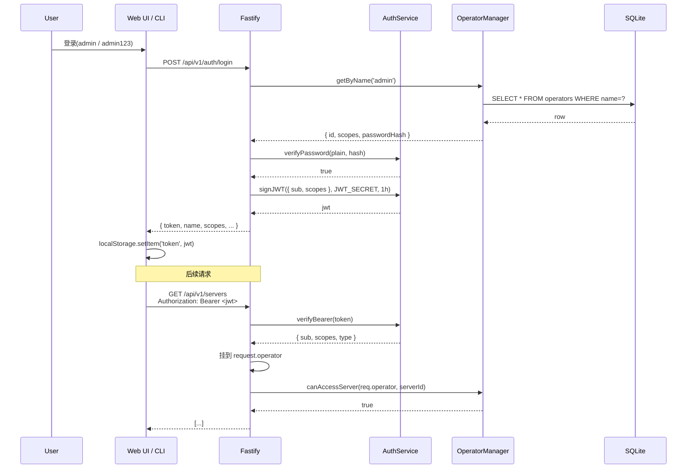
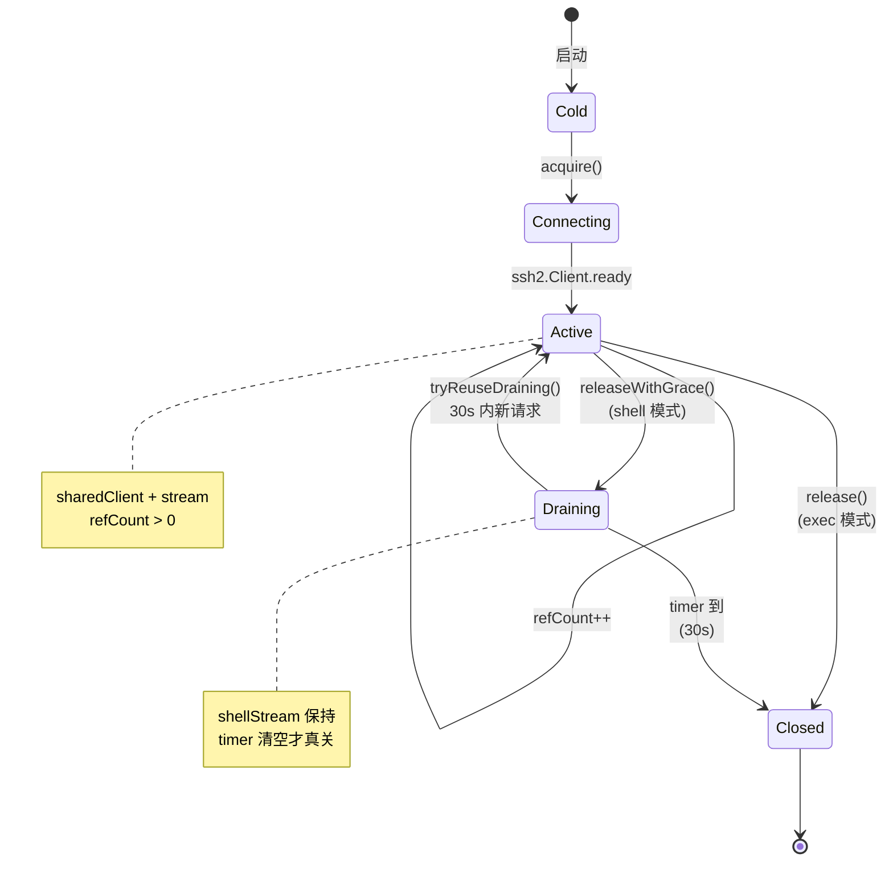
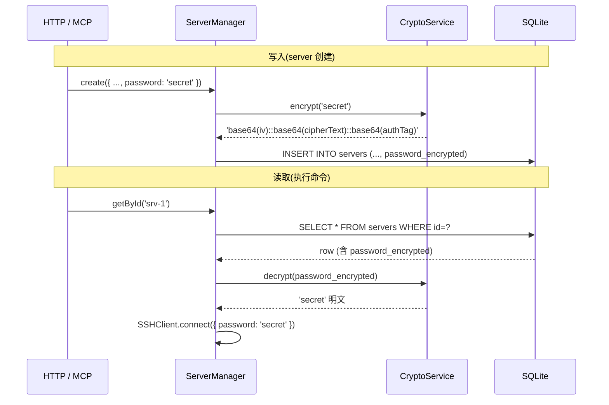
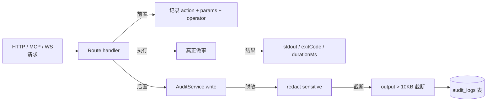
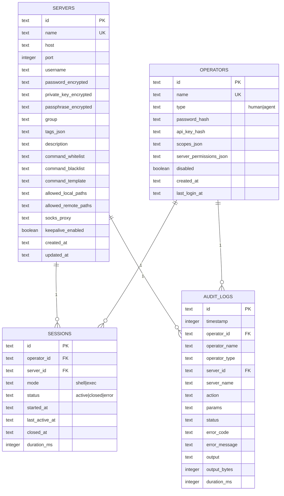
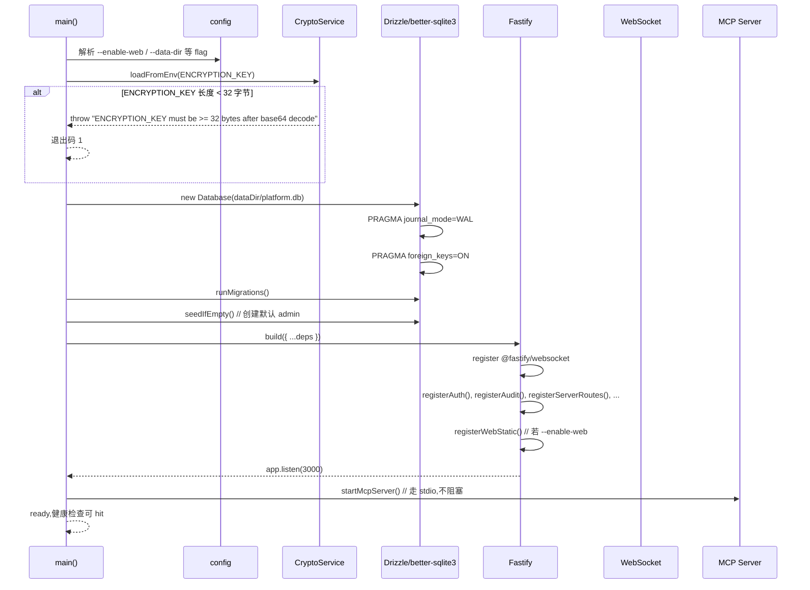

# Architecture

> **opsgate** v2.0 架构详解 — 模块划分、数据流、连接池、加密、审计。

## 1. 总览

```mermaid
graph LR
    subgraph Client[客户端]
        UI[🖥️ Web UI<br/>SPA 静态资源]
        CLI[💻 opsgate CLI]
        API[🔌 API Client]
        AGENT[🤖 AI Agent]
    end

    subgraph Edge[Edge]
        REVERSE[反代 (nginx / caddy)<br/>HTTPS + WS upgrade]
    end

    subgraph Server[opsgate Server (单进程)]
        HTTP[Fastify HTTP<br/>:3000]
        WS[Fastify WebSocket<br/>@fastify/websocket]
        MCP[MCP Server<br/>stdio]
        AUTHR[Auth Router]
        SRVR[Server Router]
        AUDITR[Audit Router]
        OPR[Operator Router]
        TERMR[Terminal Router]
        HEALTHR[Health Router]
    end

    subgraph Core[核心服务]
        SM[ServerManager]
        OM[OperatorManager]
        SSS[SSHSessionService]
        SCP[SSHConnectionPool]
        BE[BatchExecutor]
        AS[AuditService]
        CS[CryptoService]
    end

    subgraph Storage[存储]
        DB[(SQLite + WAL<br/>platform.db)]
        FS[/data<br/>上传/下载缓存/]
    end

    subgraph Remote[远端 Linux 主机]
        SSH1[SSH Server 1]
        SSH2[SSH Server 2]
    end

    UI --> REVERSE
    CLI --> HTTP
    API --> HTTP
    AGENT --> MCP

    REVERSE --> HTTP
    REVERSE --> WS

    HTTP --> AUTHR
    HTTP --> SRVR
    HTTP --> AUDITR
    HTTP --> OPR
    HTTP --> HEALTHR
    WS --> TERMR

    AUTHR --> OM
    AUTHR --> AS
    SRVR --> SM
    SRVR --> BE
    SRVR --> SSS
    SRVR --> AS
    AUDITR --> AS
    OPR --> OM
    OPR --> AS
    TERMR --> SSS
    TERMR --> AS
    HEALTHR --> SCP

    SM --> CS
    OM --> CS
    SSS --> SCP
    BE --> SSS
    BE --> AS

    CS --> DB
    SM --> DB
    OM --> DB
    AS --> DB
    SCP --> DB
    SM --> FS

    SCP -->|SSH| SSH1
    SCP -->|SSH| SSH2
    MCP --> AUTHR
    MCP --> SRVR
    MCP --> AUDITR
    MCP --> SSS
    MCP --> AS
```

---

## 2. 模块划分

### 2.1 `packages/server/src/`

```
src/
├── config/             # 启动配置 / 端口 / 数据目录
├── crypto/             # AES-256-GCM 加密封装
│   └── crypto-service.ts
├── db/                 # Drizzle schema + migrate
│   ├── schema.ts       # 4 张表定义
│   ├── migrate.ts      # 自动 migrate 入口
│   └── index.ts        # better-sqlite3 实例 + WAL
├── http/               # Fastify HTTP 层
│   ├── server.ts       # app 工厂 + plugin 注册
│   ├── auth.ts         # JWT / API Key 鉴权中间件
│   ├── audit.ts        # 审计读写中间件
│   └── routes/         # 各 REST 端点
│       ├── auth.ts
│       ├── health.ts
│       ├── servers.ts
│       ├── audit.ts
│       ├── operators.ts
│       └── terminal.ts # WebSocket 路由
├── mcp/                # MCP Server 工具实现
│   ├── server.ts
│   └── tools/
│       ├── execute-command.ts
│       ├── batch-execute-command.ts
│       ├── upload.ts
│       ├── download.ts
│       ├── list-servers.ts
│       ├── get-server-status.ts
│       ├── search-files.ts
│       └── query-audit-logs.ts
├── services/           # 业务逻辑(无 HTTP / MCP 依赖)
│   ├── auth-service.ts         # JWT 签发 / bcrypt
│   ├── server-manager.ts       # servers 表 CRUD + RBAC 过滤
│   ├── operator-manager.ts     # operators 表 CRUD + API key 轮换
│   ├── ssh-session-service.ts  # 单 session 生命周期(acquire / release)
│   ├── ssh-connection-pool.ts  # 多 session 池化 + 30s 宽限期
│   ├── ssh-connection-manager.ts # ssh2 Client 封装
│   ├── batch-executor.ts       # 并行 + 汇总
│   └── audit-service.ts        # 写 audit_logs + 脱敏
├── utils/              # 通用工具
└── index.ts            # 入口:解析 CLI flag → 启 HTTP/MCP
```

### 2.2 `packages/cli/src/`

```
src/
├── index.ts            # 入口,声明 25+ 子命令 + main()
├── api/                # HTTP client 封装(自动 Bearer)
├── config/             # 配置文件读写(~/.config/opsgate/)
├── commands/           # (合并在 index.ts) 实际是函数 + Commander 注册
└── output/             # table / json / text formatter
```

### 2.3 `packages/web/`

```
src/
├── api/client.ts       # fetch 封装 + JWT 注入 + 401 跳登录
├── pages/
│   ├── Login.tsx
│   ├── Dashboard.tsx   # 仪表盘
│   ├── Servers.tsx     # 列表 + 过滤
│   ├── ServerDetail.tsx # 6 Tab
│   ├── Operators.tsx   # 用户管理
│   └── Audit.tsx       # 全量审计
├── components/
│   ├── Layout.tsx
│   ├── Terminal.tsx    # xterm.js + WS 客户端
│   └── ...
├── router.tsx
├── App.tsx
└── main.tsx
```

---

## 3. 鉴权数据流



**两种 token 形式**:
- **JWT** — 人用,1h 过期,带 scopes + serverPermissions
- **API Key**(`sk-xxx`)— AI Agent 用,永久,落库时 bcrypt 哈希,鉴权时找原始 key

统一 `verifyBearer` 自动判别。

---

## 4. SSH 连接池



**Key 设计点**:

| 字段 | 说明 |
|------|------|
| `key` | `${operatorId}::${serverId}::${mode}`(shell / exec) |
| `mode === 'shell'` | 走 SSH shell 模式,persistent,有 `draining` 宽限 |
| `mode === 'exec'` | 走 SSH exec 模式,单次,无宽限 |
| `refCount` | 当前持有者数;为 0 才进 draining |
| `draining: Map<key, { entry, timer, expireAt }>` | 30s 复用窗口 |
| `tryReuseDraining(key)` | 新 acquire 时如果 key 在 draining 且未过期,refCount += 1,return entry |
| `disconnectAll()` | 优雅关闭:清 draining 定时器,逐个 end() ssh2 client |

**为什么 shell 要 30s 宽限?**
- Web 终端关闭浏览器,server 侧还活着
- 用户在 30s 内回来,直接复用(零 SSH 握手)
- 30s 过期,自动关 stream + client,释放 fd

---

## 5. 加密流程



**加密参数**:
- 算法:AES-256-GCM
- Key:32 字节 = `base64Decode(ENCRYPTION_KEY)`
- IV:12 字节随机(每条数据独立)
- Auth Tag:16 字节(防篡改)
- 存储格式:`base64(iv) + "::" + base64(cipherText) + "::" + base64(authTag)`

**为什么 GCM?**
- 提供 authenticated encryption,防篡改
- IV 12 字节 = 96 bit 是 GCM 的最优大小
- 每次随机 IV 杜绝重放

---

## 6. 审计数据流



**audit_logs 表结构**:
| 字段 | 类型 | 说明 |
|------|------|------|
| `id` | TEXT PK | uuid |
| `timestamp` | INTEGER | epoch ms |
| `operatorId` | TEXT | 谁(可空,系统调用) |
| `operatorName` | TEXT | 冗余 name(operator 删除后仍可查) |
| `operatorType` | TEXT | `human` / `agent` / `system` |
| `serverId` | TEXT | 哪台机器 |
| `serverName` | TEXT | 冗余 name |
| `action` | TEXT | `execute-command` / `terminal.open` / ... |
| `params` | TEXT (JSON) | 输入参数(脱敏后) |
| `status` | TEXT | `success` / `failed` / `denied` / `cancelled` |
| `errorCode` | TEXT | 应用错误码 |
| `errorMessage` | TEXT | 错误消息(脱敏后) |
| `output` | TEXT | stdout(脱敏 + 截断后) |
| `outputBytes` | INTEGER | 原始字节数 |
| `durationMs` | INTEGER | 耗时 |

**脱敏规则**(在 `redactSensitive`):
- `password=xxx` / `passphrase=xxx` → `password=<REDACTED>`
- `BEGIN PRIVATE KEY ... END PRIVATE KEY` → `<PRIVATE_KEY_REDACTED>`
- `Bearer sk-xxx` → `Bearer <REDACTED>`
- IPv4 / 域名不脱敏(可能业务需要)

---

## 7. 数据模型



**索引**:
- `servers(group, name)` — 列表过滤
- `audit_logs(timestamp DESC)` — 时间倒序
- `audit_logs(server_id, timestamp DESC)` — 单机审计
- `audit_logs(operator_id, timestamp DESC)` — 单人审计
- `sessions(server_id, status)` — 活跃会话查询

---

## 8. 启动流程



---

## 9. 性能特征

| 指标 | 实测 | 备注 |
|------|------|------|
| 启动时间 | ~1.3s | boot → first /health 200 |
| 健康检查 RT | < 50ms | 纯 DB query |
| 服务器列表 1000 条 | < 100ms | 分页 + 索引 |
| 单命令 exec | SSH 耗时 + 30ms | 走连接池,无 2 次 SSH 握手 |
| Web 终端 1KB echo | < 10ms | 走 WebSocket,端到端 |
| 审计写 | < 5ms | 单条 INSERT,WAL 异步落盘 |
| Docker 镜像大小 | ~200MB | multi-stage + alpine |

---

## 10. 扩展点

| 想加什么 | 改哪里 |
|---------|--------|
| 新 MCP 工具 | `packages/server/src/mcp/tools/<name>.ts`,在 `server.ts` 注册 |
| 新 REST 端点 | `packages/server/src/http/routes/<name>.ts`,在 `server.ts` 注册 |
| 新 CLI 子命令 | `packages/cli/src/index.ts`,在 `main()` 加 `program.command(...)` |
| 新 Web 页面 | `packages/web/src/pages/<Name>.tsx`,在 `router.tsx` 加 `<Route>` |
| 新审计 action | 直接传 `action: "your.action"`,自动落库 |
| 换 DB(比如 Postgres) | 改 `packages/server/src/db/schema.ts` 用 drizzle-orm/pg-core,改 `index.ts` 的 driver |

---

## 下一步

- [docs/CLI.md](CLI.md) — 25+ 子命令参考
- [docs/API.md](API.md) — 13 端点参考
- [docs/MCP.md](MCP.md) — 8 工具 schema
- [docs/DEPLOY.md](DEPLOY.md) — Docker 部署
- [docs/SECURITY.md](SECURITY.md) — 安全模型
- [docs/CONTRIBUTING.md](../CONTRIBUTING.md) — 贡献指南
