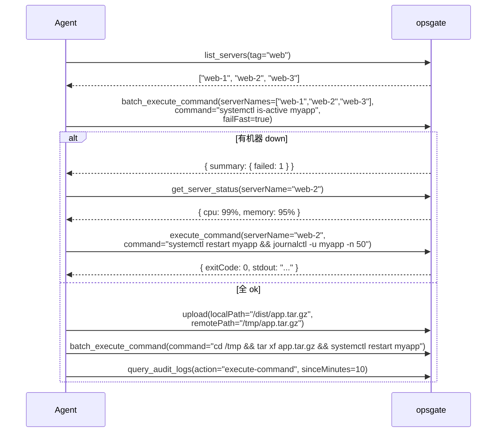

# MCP Tools Reference

> opsgate 暴露给 AI Agent 的 **8 个 MCP 工具**。
> 兼容原 `@fangjunjie/ssh-mcp-server` v1 的 4 个 tool,新增 4 个。

## 集成方式

### Claude Code / Cursor / Cline / Continue

```json
{
  "mcpServers": {
    "opsgate": {
      "command": "npx",
      "args": [
        "-y",
        "opsgate-server",
        "--enable-web"
      ]
    }
  }
}
```

> v1 兼容:把 `opsgate-server` 替换为 `@fangjunjie/ssh-mcp-server` 仍可用,只是少了 Web 终端 / 批量 / 搜索 / 审计查询 4 个工具。

### 直接 stdio 启动
```bash
opsgate-server --enable-web
# 走 stdio JSON-RPC 跟 MCP 客户端通信
```

---

## 工具清单

| # | 工具名 | 类别 | 鉴权 | 新增于 |
|---|--------|------|------|--------|
| 1 | `execute_command` | SSH | ✅ | v1 |
| 2 | `upload` | SSH | ✅ | v1 |
| 3 | `download` | SSH | ✅ | v1 |
| 4 | `list_servers` | 查询 | ✅ | v1 |
| 5 | `get_server_status` | SSH | ✅ | **v2.0** |
| 6 | `batch_execute_command` | SSH | ✅ | **v2.0** |
| 7 | `search_files` | SSH | ✅ | **v2.0** |
| 8 | `query_audit_logs` | 查询 | ✅ | **v2.0** |

> 所有工具调用都会写 `audit_logs`,Agent 操作可追溯。

---

## 1. `execute_command`

执行单条命令(短连接 SSH exec 模式)。

**Input schema**:
```json
{
  "type": "object",
  "properties": {
    "serverName": { "type": "string", "description": "server 名或 id" },
    "command": { "type": "string" },
    "directory": { "type": "string", "description": "工作目录,可选" },
    "timeoutMs": { "type": "number", "default": 30000 }
  },
  "required": ["serverName", "command"]
}
```

**Output**:
```json
{
  "exitCode": 0,
  "stdout": "...",
  "stderr": "",
  "durationMs": 234
}
```

**Agent 示例 prompt**:
> "请检查 web-1 服务器的 nginx 状态"
> → Agent 调 `execute_command(serverName="web-1", command="systemctl status nginx")`

---

## 2. `upload`

本地文件上传到远端(走 SFTP)。

**Input schema**:
```json
{
  "type": "object",
  "properties": {
    "serverName": { "type": "string" },
    "localPath": { "type": "string", "description": "容器/服务器可访问的绝对路径" },
    "remotePath": { "type": "string" },
    "mode": { "type": "number", "description": "文件权限,如 0o644" }
  },
  "required": ["serverName", "localPath", "remotePath"]
}
```

**Output**:
```json
{ "success": true, "bytesTransferred": 12345, "durationMs": 123 }
```

**限制**:
- `localPath` 必须在 server 启动时的 `allowedLocalPaths` 白名单里
- `remotePath` 必须在 `allowedRemotePaths` 白名单里(防覆盖 `~/.ssh/authorized_keys`)

---

## 3. `download`

远端文件下载到本地(走 SFTP)。

**Input schema**:
```json
{
  "type": "object",
  "properties": {
    "serverName": { "type": "string" },
    "remotePath": { "type": "string" },
    "localPath": { "type": "string" }
  },
  "required": ["serverName", "remotePath", "localPath"]
}
```

---

## 4. `list_servers`

列出当前 operator 有权访问的所有 server。

**Input schema**:
```json
{
  "type": "object",
  "properties": {
    "group": { "type": "string" },
    "tag": { "type": "string" },
    "nameLike": { "type": "string" }
  }
}
```

**Output**:
```json
{
  "servers": [
    { "id": "srv-1", "name": "web-1", "host": "...", "group": "...", "tags": [...] }
  ],
  "count": 1
}
```

> ⚠️ 不返回凭证。

---

## 5. `get_server_status` (v2.0 新增)

拉单台机器的实时状态:CPU / 内存 / 磁盘 / 负载 / uptime。

**Input schema**:
```json
{
  "type": "object",
  "properties": {
    "serverName": { "type": "string" }
  },
  "required": ["serverName"]
}
```

**Output**:
```json
{
  "serverName": "web-1",
  "cpu": { "usagePercent": 12.5, "cores": 4 },
  "memory": { "total": 8589934592, "used": 4294967296, "usagePercent": 50.0 },
  "disk": [
    { "mount": "/", "total": 50, "used": 12, "usagePercent": 24 }
  ],
  "loadAverage": [0.5, 0.7, 0.9],
  "uptime": 8640000,
  "collectedAt": 1719000000000
}
```

**实现**:
- server 上跑 `top -bn1` / `free -m` / `df -h` / `uptime`,正则解析
- 默认 timeout 15s

---

## 6. `batch_execute_command` (v2.0 新增)

在多台 server 并行执行同一条命令,带 `summary` 汇总。

**Input schema**:
```json
{
  "type": "object",
  "properties": {
    "serverNames": { "type": "array", "items": { "type": "string" } },
    "group": { "type": "string" },
    "tag": { "type": "string" },
    "command": { "type": "string" },
    "directory": { "type": "string" },
    "timeoutMs": { "type": "number", "default": 30000 },
    "parallel": { "type": "number", "default": 5 },
    "failFast": { "type": "boolean", "default": false }
  },
  "required": ["command"]
}
```

> `serverNames` 和 `group` / `tag` 至少二选一。

**Output**:
```json
{
  "results": [
    { "serverName": "web-1", "exitCode": 0, "stdout": "...", "durationMs": 200 },
    { "serverName": "web-2", "exitCode": 0, "stdout": "...", "durationMs": 180 }
  ],
  "summary": {
    "total": 2,
    "succeeded": 2,
    "failed": 0,
    "totalDurationMs": 380
  }
}
```

**Agent 示例 prompt**:
> "在所有 production group 的机器上跑 `uptime`,并发 10 台,任一失败立即停"
> → Agent 调 `batch_execute_command(group="production", command="uptime", parallel=10, failFast=true)`

---

## 7. `search_files` (v2.0 新增)

在多台 server 上 find / grep / locate。

**Input schema**:
```json
{
  "type": "object",
  "properties": {
    "serverNames": { "type": "array", "items": { "type": "string" } },
    "group": { "type": "string" },
    "tag": { "type": "string" },
    "mode": { "type": "string", "enum": ["find", "grep", "locate"], "default": "grep" },
    "pattern": { "type": "string" },
    "path": { "type": "string", "default": "/" },
    "parallel": { "type": "number", "default": 5 }
  },
  "required": ["pattern"]
}
```

**Output**:
```json
{
  "results": [
    { "serverName": "web-1", "mode": "grep", "pattern": "ERROR", "matches": ["/var/log/nginx/error.log:42:..."] }
  ]
}
```

**Agent 示例 prompt**:
> "在所有 web 机器的 /var/log 里找 ERROR 开头的行"
> → Agent 调 `search_files(tag="web", mode="grep", pattern="^ERROR", path="/var/log")`

---

## 8. `query_audit_logs` (v2.0 新增)

查询 `audit_logs`。

**Input schema**:
```json
{
  "type": "object",
  "properties": {
    "serverId": { "type": "string" },
    "operatorId": { "type": "string" },
    "action": { "type": "string" },
    "status": { "type": "string", "enum": ["success", "failed", "denied", "cancelled"] },
    "sinceMinutes": { "type": "number" },
    "limit": { "type": "number", "default": 50, "maximum": 200 }
  }
}
```

**Output**:
```json
{
  "logs": [
    {
      "id": "...",
      "timestamp": 1719000000000,
      "operatorName": "admin",
      "serverName": "web-1",
      "action": "execute-command",
      "params": "{\"command\":\"uptime\"}",
      "status": "success",
      "durationMs": 234
    }
  ],
  "total": 1
}
```

**Agent 示例 prompt**:
> "我 1 小时前在 db-1 上执行过什么命令?"
> → Agent 调 `query_audit_logs(serverId="db-1", sinceMinutes=60)`

---

## 8 个工具协同示例

**场景:Agent 自动化部署**



---

## 安全注意事项

- **Agent 是高权限实体**,默认给 API Key 时应只授必要的 scope(例:`read` + `write` 限定的 serverPermissions 白名单)
- **定期 rotate-key**:`opsgate agent rotate-key <name>` 或 Web UI
- **定期查审计**:`opsgate audit list --operatorId <agent-name>` 看 Agent 干了啥
- **敏感操作加约束**:在 server 端用 `commandWhitelist` / `commandBlacklist` 限制 Agent 能跑的命令
  ```json
  {
    "commandWhitelist": "^(systemctl|journalctl|ls|cat|grep)\\s.*$",
    "commandBlacklist": "^rm\\s+-rf\\s+/$"
  }
  ```

---

## 下一步

- [docs/API.md](API.md) — REST 13 端点
- [docs/CLI.md](CLI.md) — CLI 25+ 子命令
- [docs/ARCHITECTURE.md](ARCHITECTURE.md) — 架构
- [docs/SECURITY.md](SECURITY.md) — 安全模型
